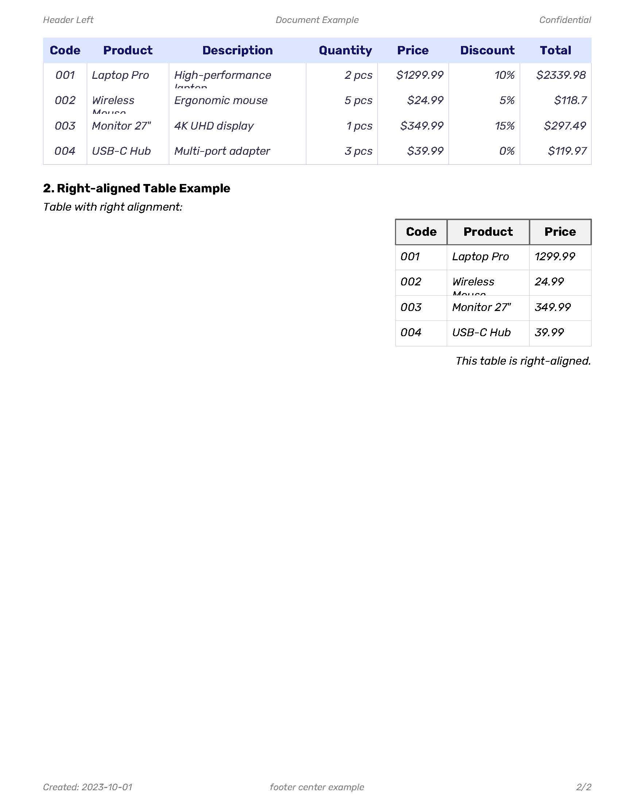

# docpdf

An open-source Go library for generating PDFs with a minimalist and intuitive API, similar to writing in Word. Optimized to run in the browser with WebAssembly without dependencies.

## Description

docpdf is a Go library that allows you to generate PDF documents with an intuitive and simple API. It is designed to be easy to use, with an approach similar to writing in a word processor like Word. The library is optimized to work in the browser with WebAssembly.

The main focus of this library is to compile into a compact binary size using TinyGo for frontend usage, as standard Go binaries tend to be large. This makes it ideal for web applications where binary size matters.

### Font Convention

By default, `docpdf` expects the following font files in the `fonts/` directory (relative to your application's execution path or as specified in `Font.Path`):

*   `regular.ttf`: For the normal text style.
*   `bold.ttf`: For the bold text style.
*   `italic.ttf`: For the italic text style.

You can override these defaults by providing a custom `Font` configuration when creating the document:

```go
customFont := docpdf.Font{
    Regular: "MyCustomFont-Regular.ttf",
    Bold:    "MyCustomFont-Bold.ttf",
    Italic:  "MyCustomFont-Italic.ttf",
    Path:    "assets/fonts/", // Optional: specify a different path
}
doc := docpdf.NewDocument(customFont)
```

If you only provide `Regular`, the library will use the regular font for bold and italic styles as well.

### TinyGo Compatibility Checklist

The following standard libraries will be replaced or modified as they are not 100% compatible with TinyGo, in order to reduce the binary size:

- [ ] bufio
- [ ] crypto/sha1
- [ ] errors
- [ ] fmt
- [ ] golang.org/x/image
- [ ] io
- [ ] os
- [ ] path/filepath
- [ ] sort
- [ ] strings
- [ ] sync
- [ ] time

## Getting Started

Creating a new document is simple. A file writer function is optional but can be provided to customize how the PDF is saved:

```go
// Basic usage with default file writer (uses os.WriteFile in backend environments)
doc := NewDocument()

// With custom file writer
doc := NewDocument(os.WriteFile)

// For web applications (example using a fictional HTTP response interface)
doc := NewDocument(func(filename string, data []byte) error {
    resp.Header().Set("Content-Type", "application/pdf")
    resp.Header().Set("Content-Disposition", "attachment; filename="+filename)
    _, err := resp.Write(data)
    return err
})
```

## Page Size Options

The library offers multiple ways to specify page sizes for your documents:

1. **Using predefined page sizes**:
   ```go
   doc := NewDocument(PageSizeA4)  // Use A4 page size
   doc := NewDocument(PageSizeLetter)  // Use Letter page size
   ```

2. **Using the new PageSize struct with unit specification**:
   ```go
   // Create an A4 page size (210mm x 297mm) with millimeter units
   doc := NewDocument(PageSize{Width: 210, Height: 297, Unit: UnitMM})
   
   // Create a US Letter page size (8.5in x 11in) with inch units
   doc := NewDocument(PageSize{Width: 8.5, Height: 11, Unit: UnitIN})
   ```

3. **Combining options**:
   ```go
   doc := NewDocument(
      PageSize{Width: 210, Height: 297, Unit: UnitMM},  // A4 size
      margins.Margins{Left: 15, Top: 10, Right: 10, Bottom: 10},  // Custom margins.Margins
      os.WriteFile  // Custom file writer (optional)
   )
   ```

## Usage Example:

### Page 1

### Page 2


This example shows the main features of the library:

```go
	// Create a document with default settings
	doc := NewDocument()

	// Or with custom file writer
	// doc := NewDocument(os.WriteFile)

	// Setup header and footer with the new API
	doc.SetPageHeader().
		SetLeftText("Header Left").
		SetCenterText("Document Example").
		SetRightText("Confidential").
		// ShowOnFirstPage()

		// Add footer with page numbers in format X/Y
		doc.SetPageFooter().
		SetLeftText("Created: 2023-10-01").
		SetCenterText("footer center example").
		WithPageTotal(Right).
		ShowOnFirstPage()

	// add logo image
	doc.AddImage("test/res/logo.png").Height(35).Inline().Draw()

	// add date and time aligned to the right
	doc.AddText("date: 2024-10-01").AlignRight().Inline().Draw()

	// Add a centered header
	doc.AddHeader1("Example Document").AlignCenter().Draw()

	// Add a level 2 header
	doc.AddHeader2("Section 1: Introduction").Draw()

	// Add normal text
	doc.AddText("This is a normal text paragraph that shows the basic capabilities of the gopdf library. " +
		"We can create documents with different text styles and formats.").Draw()

	// Add text with different styles
	doc.AddText("This text is in bold.").Bold().Draw()

	doc.AddText("This text is in italic.").Italic().Draw()

	// Add right-aligned text (ensuring it's in regular style, not italic)
	doc.AddText("This text is right-aligned.").Regular().AlignRight().Draw()

	// Create and add a bar chart using the new API instead of static image
	barChart := doc.AddBarChart().
		Title("Monthly Sales").
		Height(320).	
		AlignCenter().
		BarWidth(50).
		BarSpacing(10)

	// Add data to the chart
	barChart.AddBar(120, "Jan").
		AddBar(140, "Feb").
		AddBar(160, "Mar").
		AddBar(180, "Apr").
		AddBar(120, "May").
		AddBar(140, "Jun")

	// Configurar el gráfico para mostrar los ejes
	barChart.WithAxis(true, true)

	// Renderizar el gráfico
	barChart.Draw()

	// Save the document to a file
	err := doc.WritePdf("example_document.pdf")
	if err != nil {
		log.Fatalf("Error writing PDF: %v", err)
	}
```

## Current Development Focus: Direct Chart Rendering

We are currently working on improving how charts are rendered within PDF documents.

**Problem:** The current method renders charts as intermediate images (SVG/PNG), which are then embedded as raster images in the PDF. This is inefficient, leads to loss of vector quality, and relies on dependencies like `freetype`, hindering the goal of creating a lightweight library suitable for TinyGo and browser environments.

**Solution in Progress:** We are implementing a direct rendering approach. This involves:
1.  Creating a new internal `chartengine` package (starting with bar charts) that calculates layout using PDF units (points).
2.  Developing a `pdfRenderer` that translates drawing commands from `chartengine` directly into vector drawing commands for the underlying PDF engine (`PdfEngine`).

This will result in true vector graphics for charts within the PDF, eliminate the `freetype` dependency for charts, improve performance, and align with the goal of a smaller, browser-friendly library.

## Acknowledgements

This library would not have been possible without github repositories:
- signintech/gopdf
- phpdave11/gofpdi
- wcharczuk/go-chart


## Important

this library is still in development and not all features are implemented yet. please check the issues for more information.
